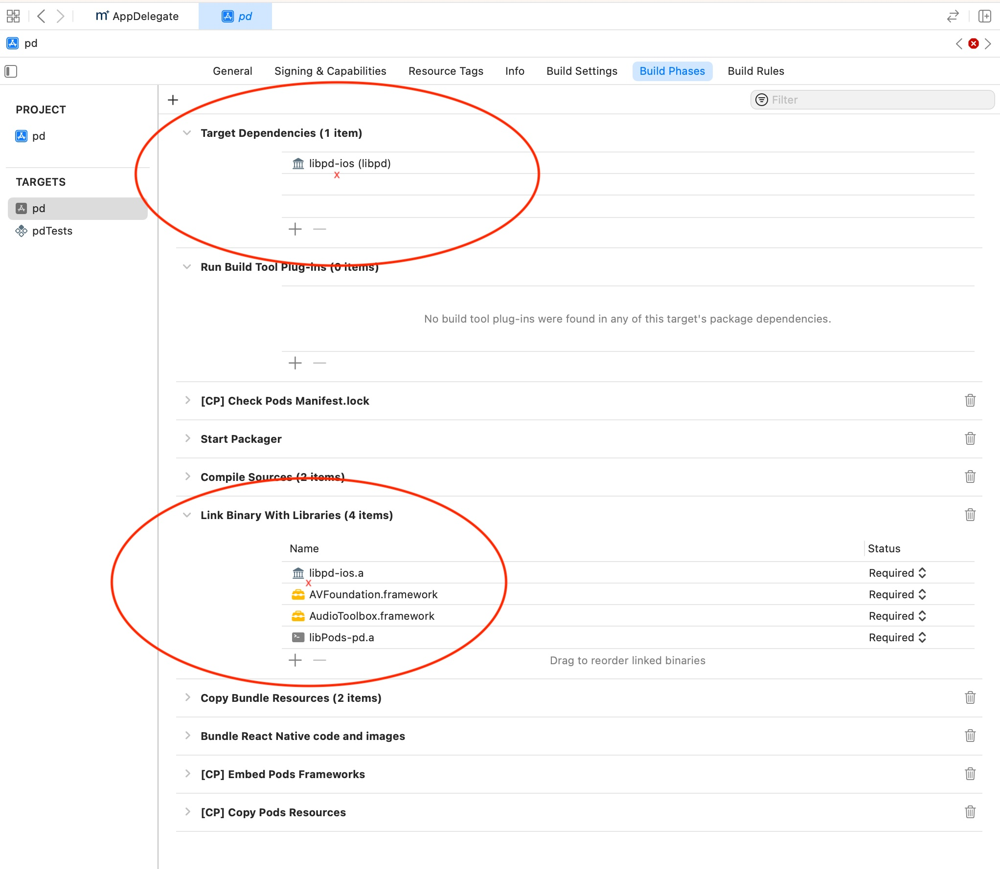

# PD for React Native

This is a proof-of-concept implementation of the `pd-for-ios` and `pd-for-android` `libpd` libraries.

## Setup

On iOS, you need to follow the steps in the [pd-for-ios repository](https://github.com/libpd/pd-for-ios) to download the submodules.
On Android, you'll only need to follow the setup if you're migrating to an existing project.

### iOS Setup

the [pd-for-ios repository](https://github.com/libpd/pd-for-ios) is _extremely_ light on details. [this guy's video series](https://www.youtube.com/watch?v=l5GQqCDmBZY) is _very_ detailed if you end up getting in the weeds. these two steps are the biggest gotchas.

- add lib to _Target Dependencies_ and _Link Binaries with Libraries_
  
- add patch to _User Header Search Paths_ being sure to select `recursive`
  

### Android setup

Android is pretty easy. [Follow the steps in the repo README](https://github.com/libpd/pd-for-android)

## Editing and adding patches

Patches need to be manually updated in both the `ios` and `android` apps. There is a better solution to this problem, but here is my current workflow:

- work on patches in `ios/patches` using desktop pd
- test on ios.
- save and commit changes as needed. you'll need to re-build app to see changes. live reload will not work.
- zip `patches` folder and copy to `android/app/src/main/res/raw` overwriting previous version.
- test android

## Troubleshooting

- [The official docs for Native Modules](https://reactnative.dev/docs/native-modules-intro) will answer a lot of questions (and they're also frustratingly brief.)
- I recommend working on native files in native editors. ie obj-c files in XCode and .java files in Android Studio. Those IDEs have lots of built-in features that will do you favors.
- `AppDelegate.mm` and `MainActivity.java` each have a commented out line that can load a patch manually, bypassing the Native Module. You can also load `test_tone_on.pd` which will play a sound without any interaction.
